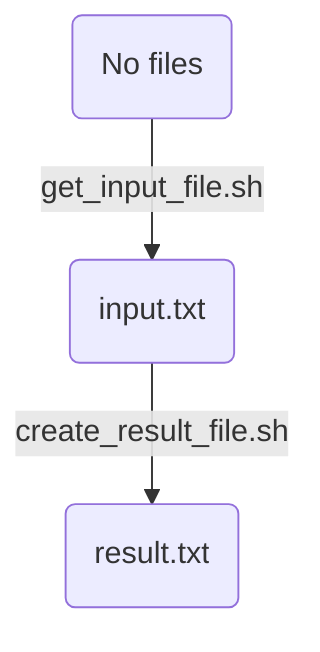

# nextflow_example_2

[Nextflow example](https://github.com/richelbilderbeek/nextflow_examples) 2:
my first own minimal Nextflow script

```mermaid
flowchart TD
    A(No files) -->|get_input_file.sh| B(input.txt)
    B --> |create_result_file.sh| C(result.txt)
```
